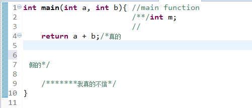
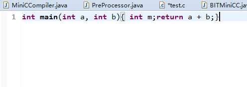
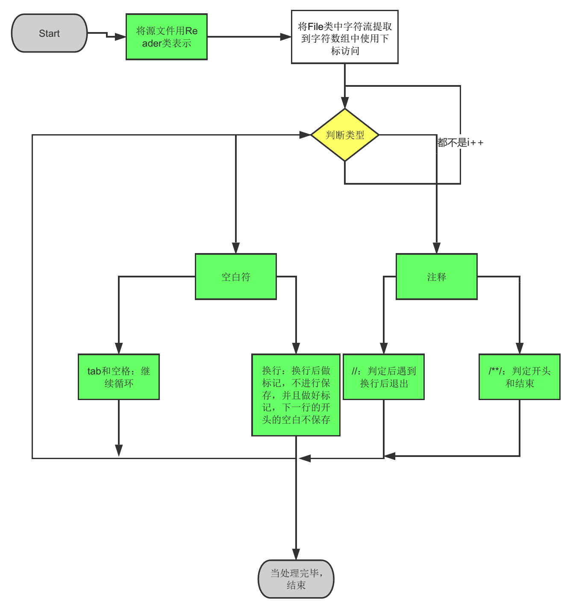

# 预处理器

## 1.说明
    对输入的源程序进行预处理，实现讲空白符和注释去掉
## 2.实现效果
处理前的示例：

处理后的示例：
)

## 3.代码说明

在包pp下创建包 建立类：''PreProcessor'' 实现了接口"IMiniCCPreProcessor"

IO:使用字符输出流Reader，Writer 对文件实现读写

将文件中的内容存在字符数组 char[] 中进行保存，逐个字符进行处理，判断三类空白字符

空白，tab，以及回车符。注释分别判断"//" 和"/**/"

程序流程


## 源代码
```java
public class PreProcessor implements IMiniCCPreProcessor {
    File inFile;
	File outFile;
	Reader inFileReader;
	Writer outFileWriter;
	// numInFile 统计输入文件中的字符的个数
	int numInFile;
	// 获得字符的数组
	char buffer[] = new char[20000];
	// 数组的下标
	int i = 0;
	//遇到换行的特殊处理
	int if_can_solve = 0;
	//行首的空格处理。
	int if_line_statr = 0;
	String Out = new String();

	@Override
	public void run(String iFile, String oFile) {
		// TODO Auto-generated method stub
		// 将输入文件用File 类表示
		inFile = new File(iFile);
		outFile = new File(oFile);
		// 初始化字符流 类
		try {
			inFileReader = new FileReader(inFile);
			outFileWriter = new FileWriter(outFile);
			numInFile = inFileReader.read(buffer);
			preprocess();
			outFileWriter.write(Out);
			outFileWriter.close();
			inFileReader.close();
		} catch (FileNotFoundException e) {
			// TODO Auto-generated catch block
			e.printStackTrace();
		} catch (IOException e) {
			// TODO Auto-generated catch block
			e.printStackTrace();
		}
	}

	// 预处理开始
	void preprocess() {

		while (true) {
			if_can_solve = 0;
			if (i >= numInFile) {
				break;
			}
			// 如果是空格,tab或者回车
			if (buffer[i] == ' ' || buffer[i] == '\t' || buffer[i] == '\r') {
				skip_white_space();
			} else if (buffer[i] == '/') {
				//非空格
				if_line_statr=0;
				// 查看下一个字符是不是注释的开始符号
				if (buffer[i + 1] == '*') {
					i++;// 是注释/*的开始部分
					parse_comment();
				}
				if (buffer[i + 1] == '/') {
					i++;// 是//注释
					// 当遇到回车，换行失效
					while (true) {
						i++;
						if (buffer[i] == '\r') {
							i++;
							if (buffer[i] == '\n') {
								if_can_solve=1;
								if_line_statr=1;
							}
							break;
						}
					}
				}
			}

			if(if_can_solve!=1){
				if ((buffer[i] == ' ' || buffer[i] == '\t' 
						|| buffer[i] == '\r')&&if_line_statr==1) {
					//如果是空格，并且是开头
				}else{
					// 将处理后的字符存储
					Out += buffer[i];
					if_line_statr=0;
				}
			}

			i++;
		}
	}

	/*
	 * 删除注释
	 */
	void parse_comment() {
		i++;
		while (true) {
			if (i >= numInFile) {
				break;
			}
			// 注释完毕
			if (buffer[i] == '*' && buffer[i + 1] == '/') {
				i++;
				if_can_solve=1;
				return;
			}
			i++;
		}
	}

	/*
	 * 忽略空白符
	 */
	void skip_white_space() {
		// 忽略空格，Tab和回车
		while (buffer[i] == ' ' || buffer[i] == '\t' || buffer[i] == '\r') {
			if (i >= numInFile) {
				break;
			}
			// '/r' 是到行首，'\n'是到下一行
			if (buffer[i] == '\r') {
				// 是否是换行,遇到换行调到下一行
				if (buffer[i+1] == '\n') {
					i++;
					if_can_solve=1;
					if_line_statr=1;
					return;
				}

			}
			i++;
		}
		//如果不是行首，那么单词间保留一个空格
		i--;
	}

}

```